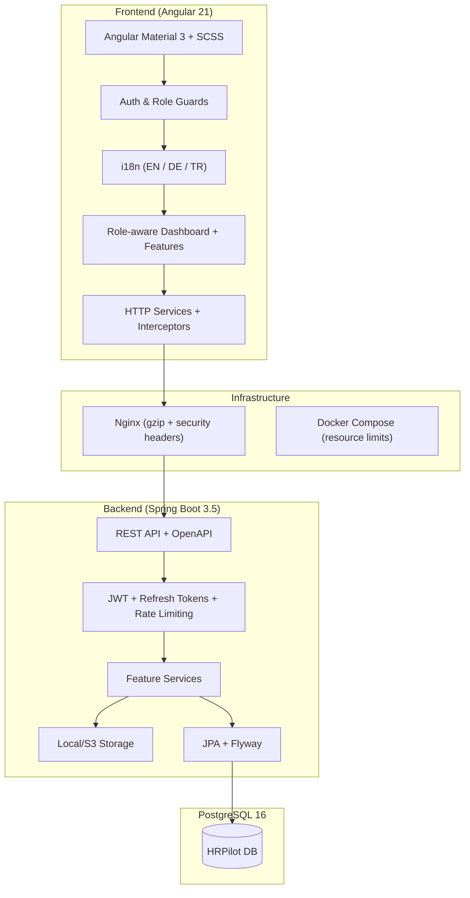

# HRPilot

[](https://github.com/Krookskala/HRPilot/actions)


HRPilot is a single-company HR platform built with Spring Boot and Angular. It includes invite-based onboarding, employee self-service, scoped leave approvals, payroll runs with payslips, notifications, audit logging, role-aware dashboards, and multi-language support.

---


---

## Product Scope

- Invite-only account setup with password reset, refresh-token rotation, logout revocation, and `/api/me` as the canonical current-user source
- Admin user management with role updates, activation control, and invite re-issue flows
- Employee profiles with employment history, photo upload, secured HR documents, and card/table directory view
- Germany-aware leave workflow with working-day calculation, holiday support, overlap protection, scoped approvals, cancellation flow, and request history
- Payroll runs with configurable tax class input, structured payroll components, publish/pay lifecycle, generated PDF payslips, and employee self-service payroll access
- Department management with CRUD operations, hierarchical parent departments, and manager assignment
- In-app notifications with individual and bulk mark-as-read, plus audit logging for sensitive or workflow-driven actions
- Role-aware dashboard experiences for `ADMIN`, `HR_MANAGER`, `DEPARTMENT_MANAGER`, and `EMPLOYEE`
- Reports page with leave, payroll, team summaries, and CSV employee export
- Settings page with language preferences (English, German, Turkish)
- Audit log viewer for admin-level security event tracking

## Architecture



## Stack

| Layer | Technology |
| --- | --- |
| Backend | Java 21, Spring Boot 3.5, Spring Security, Spring Data JPA, Flyway |
| Frontend | Angular 21 standalone components, Angular Material 3, SCSS, RxJS |
| Database | PostgreSQL 16 |
| Auth | JWT access tokens + rotating refresh tokens + rate limiting |
| Storage | Local filesystem fallback, S3-compatible object storage |
| Documents | Apache PDFBox for payslips |
| API Docs | SpringDoc OpenAPI / Swagger UI |
| i18n | ngx-translate (English, German, Turkish) |
| Testing | JUnit 5 + Mockito (backend), Vitest + jsdom (frontend), Playwright (e2e) |
| CI/CD | GitHub Actions + OWASP dependency-check + npm audit |
| Infrastructure | Docker Compose, Nginx with gzip and security headers |

## Main Modules

### Identity and Access

- `POST /api/auth/login`
- `POST /api/auth/refresh`
- `POST /api/auth/logout`
- `GET /api/auth/invitations/{token}`
- `POST /api/auth/invitations/accept`
- `POST /api/auth/password/request`
- `GET /api/auth/password/{token}`
- `POST /api/auth/password/reset`
- `GET /api/me`
- `GET /api/me/profile`

### User and Profile Management

- `GET /api/users`
- `POST /api/users/invite`
- `PUT /api/users/{id}`
- `POST /api/users/{id}/resend-invite`
- `GET /api/employees`
- `GET /api/employees/{id}/detail`
- `POST /api/employees/{id}/photo`
- `GET /api/employees/{id}/documents`
- `POST /api/employees/{id}/documents`
- `GET /api/employees/export/csv`

### Department Management

- `GET /api/departments`
- `POST /api/departments`
- `PUT /api/departments/{id}`
- `DELETE /api/departments/{id}`

### Leave Workflow

- `GET /api/leave-requests`
- `GET /api/me/leave-requests`
- `GET /api/leave-requests/{id}/history`
- `POST /api/leave-requests`
- `PUT /api/leave-requests/{id}/approve`
- `PUT /api/leave-requests/{id}/reject`
- `PUT /api/leave-requests/{id}/cancel`
- `GET /api/leave-requests/balances/{employeeId}`
- `GET /api/me/leave-balances`

### Payroll

- `GET /api/payrolls`
- `GET /api/payrolls/runs`
- `POST /api/payrolls`
- `POST /api/payrolls/preview`
- `POST /api/payrolls/runs`
- `PUT /api/payrolls/runs/{id}/publish`
- `PUT /api/payrolls/runs/{id}/pay`
- `GET /api/payrolls/{id}/components`
- `GET /api/payrolls/{id}/payslip`
- `GET /api/me/payrolls`
- `GET /api/me/payrolls/{id}/payslip`

### Notifications and Audit

- `GET /api/notifications`
- `PUT /api/notifications/{id}/read`
- `PUT /api/notifications/read-all`
- `GET /api/audit-logs`

### System

- `GET /api/dashboard`
- `GET /api/health`
- `GET /actuator/health`

## Frontend Pages

| Page | Route | Access |
| --- | --- | --- |
| Dashboard | `/dashboard` | All authenticated users |
| My Profile | `/profile` | All authenticated users |
| Notifications | `/notifications` | All authenticated users |
| Employees | `/employees` | All authenticated users |
| Employee Detail | `/employees/:id` | All authenticated users |
| Departments | `/departments` | All authenticated users |
| Leave Requests | `/leaves` | All authenticated users |
| Payrolls | `/payrolls` | All authenticated users |
| Settings | `/settings` | All authenticated users |
| Users | `/users` | ADMIN only |
| Audit Logs | `/audit-logs` | ADMIN only |
| Reports | `/reports` | ADMIN only |

## Local Development

### Prerequisites

- Java 21
- Maven 3.9+
- Node.js 22
- npm 10+
- Docker Desktop or a local PostgreSQL 16 instance

### Run with Docker

```bash
docker-compose up --build
```

Available services:

- Frontend: `http://localhost`
- Swagger UI: `http://localhost/swagger-ui/index.html` (dev profile only, via Nginx proxy)

### Run Locally

1. Start PostgreSQL:

```bash
docker run -d --name hrpilot-db \
  -e POSTGRES_DB=hrpilot \
  -e POSTGRES_USER=hrpilot \
  -e POSTGRES_PASSWORD=hrpilot123 \
  -p 5432:5432 postgres:16
```

2. Run the backend:

```bash
cd backend
mvn spring-boot:run -Dspring-boot.run.profiles=dev
```

3. Run the frontend:

```bash
cd frontend
npm ci
npm run start
```

### Demo Accounts (dev profile)

| Email | Password | Role |
| --- | --- | --- |
| admin@hrpilot.com | admin123 | ADMIN |
| lena.hoffmann@novacore-systems.de | demo1234 | HR_MANAGER |
| marco.weber@novacore-systems.de | demo1234 | DEPARTMENT_MANAGER |
| anna.peters@novacore-systems.de | demo1234 | EMPLOYEE |

All seeded employee accounts use the password `demo1234`.

## Configuration

### Core Environment Variables

| Variable | Description | Default |
| --- | --- | --- |
| `SPRING_PROFILES_ACTIVE` | Active Spring profile | `dev` |
| `DB_URL` | JDBC connection URL | `jdbc:postgresql://localhost:5432/hrpilot` |
| `DB_USERNAME` | Database username | `hrpilot` |
| `DB_PASSWORD` | Database password | `hrpilot123` |
| `JWT_SECRET` | JWT signing key (min 256-bit) | dev-only fallback |
| `APP_FRONTEND_BASE_URL` | Frontend URL for invite/reset links | `http://localhost:4200` |

When running with Docker Compose, set `APP_FRONTEND_BASE_URL=http://localhost` if you want generated invite/reset links to point to the Nginx-served frontend. Keep `http://localhost:4200` when using the Angular dev server directly.

### Storage Configuration

| Variable | Description | Default |
| --- | --- | --- |
| `APP_STORAGE_PROVIDER` | `local` or `s3` | `local` |
| `APP_STORAGE_LOCAL_UPLOAD_DIR` | Local upload directory | `uploads` |
| `APP_STORAGE_S3_BUCKET` | S3 bucket name | — |
| `APP_STORAGE_S3_REGION` | S3 region | — |
| `APP_STORAGE_S3_ENDPOINT` | Custom S3 endpoint for compatible providers | — |
| `APP_STORAGE_S3_ACCESS_KEY` | S3 access key | — |
| `APP_STORAGE_S3_SECRET_KEY` | S3 secret key | — |

## Testing

### Backend

```bash
cd backend
mvn test
```

### Frontend Unit Tests

```bash
cd frontend
npm ci
npm run test
```

### Frontend E2E Tests (Playwright)

```bash
cd frontend
npx playwright install
npm run e2e
```

### Test Baseline

| Suite | Count | Framework |
| --- | --- | --- |
| Backend unit/integration | 94 tests | JUnit 5 + Mockito |
| Frontend unit | 82 tests (12 spec files) | Vitest + jsdom |
| Frontend e2e | 2 spec files | Playwright |
| Flyway migrations | V1 through V9 | Flyway |

## CI/CD

GitHub Actions pipeline runs on push/PR to `main` or `master`:

1. **Backend** — `mvn verify` against PostgreSQL 16 service container
2. **OWASP Dependency Check** — scans backend dependencies for known vulnerabilities
3. **Frontend Build** — production build validation
4. **npm Audit** — scans frontend dependencies for known vulnerabilities
5. **Docker Build** — validates Docker image builds

## Security

- JWT access tokens with configurable expiration + rotating refresh tokens
- `@PreAuthorize` method-level RBAC on all endpoints
- Rate limiting on authentication endpoints
- Password complexity enforcement (min 12 chars, upper/lower/digit/special)
- CORS restricted to configured origins with explicit allowed headers
- Nginx security headers (X-Frame-Options, X-Content-Type-Options, X-XSS-Protection, Referrer-Policy)
- Swagger UI disabled in production profile
- Actuator endpoints restricted to health and info

## RBAC Overview

| Role | Main Responsibility |
| --- | --- |
| `ADMIN` | Full system control, user administration, audit logs, reports |
| `HR_MANAGER` | HR operations, payroll processing, global leave supervision |
| `DEPARTMENT_MANAGER` | Team-scoped leave and payroll visibility |
| `EMPLOYEE` | Personal profile, leave, payroll, and notifications |

## API Documentation

- Swagger UI: `/swagger-ui/index.html` (dev profile only)
- OpenAPI JSON: `/v3/api-docs` (dev profile only)

## Notes

- The platform is intentionally modeled as a single-company deployment.
- Email delivery is not part of v1; invite and reset links are generated and shared manually.
- In-app notifications are implemented; outbound email notifications are left for a future iteration.
- The `DataLoader` seeds demo data automatically when running with the `dev` profile on an empty database.
- Seeded demo employee photos are served from `frontend/assets/...` for demo convenience.
- Real uploaded employee photos and documents continue to use the backend storage layer (`local` or `s3`).

## Contributing

Contributions are welcome!

If you find any issues or have ideas for improvements, feel free to open an issue or submit a pull request.

Please make sure to follow the project's code of conduct.

1. **Fork the repository**
2. **Create your feature branch (git checkout -b feature/YourFeature)**
3. **Commit your changes (git commit -am 'Add some feature')**
4. **Push to the branch (git push origin feature/YourFeature)**
5. **Open a pull request**


## Links

[](ismailsariarslan7@gmail.com)

[](https://www.instagram.com/ismailsariarslan/)

[](https://www.linkedin.com/in/ismailsariarslan/)
