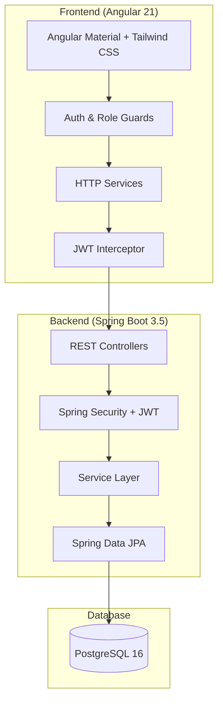

# HRPilot - HR Management Platform

[](https://github.com/Krookskala/HRPilot/actions)
[](https://openjdk.org/)
[](https://spring.io/projects/spring-boot)
[](https://angular.dev/)
[](https://www.postgresql.org/)
[](https://www.docker.com/)

A full-stack HR Management Platform built with **Spring Boot** and **Angular**, featuring role-based access control, JWT authentication, and a complete Docker deployment setup.

## Architecture



## Features

- **Authentication & Authorization** - JWT-based auth with role-based access control (RBAC)
- **Employee Management** - CRUD operations for employee records with salary tracking
- **Department Management** - Hierarchical department structure with manager assignment
- **Leave Management** - Leave request workflow with approval/rejection by managers
- **Payroll Management** - Payroll record creation with draft/paid status tracking
- **User Management** - Admin-only user administration with role assignment
- **Dashboard** - Overview with module statistics
- **Pagination** - Server-side pagination across all list views
- **Form Validation** - Client-side reactive form validation with error messages
- **API Documentation** - Interactive Swagger UI

## Tech Stack

| Layer | Technology |
|-------|-----------|
| **Backend** | Java 21, Spring Boot 3.5, Spring Security, Spring Data JPA |
| **Frontend** | Angular 21, Angular Material, Tailwind CSS, RxJS |
| **Database** | PostgreSQL 16 |
| **Auth** | JWT (jjwt 0.12.6) |
| **API Docs** | SpringDoc OpenAPI (Swagger UI) |
| **Build** | Maven, Angular CLI |
| **DevOps** | Docker, Docker Compose, GitHub Actions CI |
| **Testing** | JUnit 5, Mockito, MockMvc, Spring Boot Test |

## Project Structure

```
HRPilot/
├── backend/
│   └── src/main/java/com/hrpilot/backend/
│       ├── auth/              # Authentication (login, register)
│       ├── user/              # User management (ADMIN only)
│       ├── employee/          # Employee CRUD
│       ├── department/        # Department CRUD
│       ├── leave/             # Leave request workflow
│       ├── payroll/           # Payroll management
│       ├── config/            # Security, JWT, OpenAPI config
│       ├── common/            # Base entity, exceptions, error handling
│       └── health/            # Health check endpoint
├── frontend/
│   └── src/app/
│       ├── core/              # Guards, interceptors, services
│       ├── features/          # Feature modules (auth, dashboard, etc.)
│       ├── layout/            # Header, sidebar, main layout
│       └── shared/            # Models, shared components
├── docker-compose.yml         # Production stack
├── docker-compose.dev.yml     # Dev database only
└── .github/workflows/ci.yml  # CI pipeline
```

## API Endpoints

### Public
| Method | Endpoint | Description |
|--------|----------|-------------|
| POST | `/api/auth/register` | Register new user |
| POST | `/api/auth/login` | Login and get JWT token |
| GET | `/api/health` | Health check |

### Employees (Authenticated)
| Method | Endpoint | Roles | Description |
|--------|----------|-------|-------------|
| GET | `/api/employees` | Any | List all (paginated) |
| GET | `/api/employees/{id}` | Any | Get by ID |
| POST | `/api/employees` | ADMIN, HR_MANAGER | Create employee |
| DELETE | `/api/employees/{id}` | ADMIN, HR_MANAGER | Delete employee |

### Departments (Authenticated)
| Method | Endpoint | Roles | Description |
|--------|----------|-------|-------------|
| GET | `/api/departments` | Any | List all (paginated) |
| GET | `/api/departments/{id}` | Any | Get by ID |
| POST | `/api/departments` | ADMIN | Create department |
| DELETE | `/api/departments/{id}` | ADMIN | Delete department |

### Leave Requests (Authenticated)
| Method | Endpoint | Roles | Description |
|--------|----------|-------|-------------|
| GET | `/api/leave-requests` | Any | List all (paginated) |
| GET | `/api/leave-requests/employee/{id}` | Any | Get by employee |
| POST | `/api/leave-requests` | Any | Submit request |
| PUT | `/api/leave-requests/{id}/approve` | ADMIN, HR_MANAGER, DEPT_MANAGER | Approve |
| PUT | `/api/leave-requests/{id}/reject` | ADMIN, HR_MANAGER, DEPT_MANAGER | Reject |

### Payrolls (Authenticated)
| Method | Endpoint | Roles | Description |
|--------|----------|-------|-------------|
| GET | `/api/payrolls` | Any | List all (paginated) |
| GET | `/api/payrolls/employee/{id}` | Any | Get by employee |
| POST | `/api/payrolls` | ADMIN, HR_MANAGER | Create record |
| PUT | `/api/payrolls/{id}/pay` | ADMIN, HR_MANAGER | Mark as paid |

### Users (ADMIN only)
| Method | Endpoint | Description |
|--------|----------|-------------|
| GET | `/api/users` | List all (paginated) |
| GET | `/api/users/{id}` | Get by ID |
| POST | `/api/users` | Create user |
| PUT | `/api/users/{id}` | Update user |
| DELETE | `/api/users/{id}` | Delete user |

## Getting Started

### Prerequisites

- Java 21
- Node.js 22
- PostgreSQL 16
- Maven 3.9+
- Docker & Docker Compose (optional)

### Option 1: Docker (Recommended)

```bash
# Clone the repository
git clone https://github.com/Krookskala/HRPilot.git
cd HRPilot

# Start the full stack
docker-compose up --build

# Access the application
# Frontend: http://localhost
# Backend API: http://localhost:8080
# Swagger UI: http://localhost/swagger-ui/
```

### Option 2: Local Development

**1. Start the database:**
```bash
docker-compose -f docker-compose.dev.yml up -d
```

**2. Start the backend:**
```bash
cd backend
mvn spring-boot:run
```

**3. Start the frontend:**
```bash
cd frontend
npm install
ng serve
```

**4. Access the application:**
- Frontend: http://localhost:4200
- Backend API: http://localhost:8080
- Swagger UI: http://localhost:8080/swagger-ui/index.html

## Role-Based Access Control

| Role | Permissions |
|------|------------|
| **ADMIN** | Full access to all modules including user management |
| **HR_MANAGER** | Manage employees, payrolls, approve/reject leave requests |
| **DEPARTMENT_MANAGER** | Approve/reject leave requests for department |
| **EMPLOYEE** | View data, submit leave requests |

## Testing

```bash
cd backend
mvn test
```

**94 tests** covering:
- **Service layer** unit tests (5 modules, 47 tests)
- **Controller layer** integration tests with MockMvc (5 modules, 47 tests)
- RBAC authorization tests with `@WithMockUser`
- Exception handling and validation tests

## Environment Variables

| Variable | Description | Default |
|----------|-------------|---------|
| `POSTGRES_DB` | Database name | `hrpilot` |
| `POSTGRES_USER` | Database user | `hrpilot` |
| `POSTGRES_PASSWORD` | Database password | `hrpilot123` |
| `JWT_SECRET` | JWT signing key (min 256-bit) | dev key |

## License

This project is for educational and portfolio purposes.
